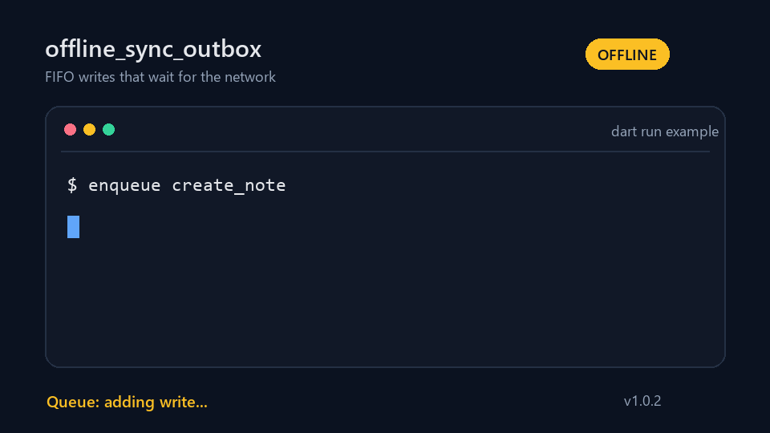

# offline_sync_outbox

[](https://pub.dev/packages/offline_sync_outbox)
[](https://github.com/dhaibanf-hue/offline_sync_outbox/actions/workflows/ci.yml)
[](LICENSE)

`offline_sync_outbox` keeps API writes in a local FIFO queue and sends them when
the app is online again. It handles ordering, persistence, and retry timing; the
actual HTTP or repository call stays in your application.

The package has no runtime dependencies.



## Install

```console
flutter pub add offline_sync_outbox
```

For a Dart project, use `dart pub add offline_sync_outbox`.

## Basic use

```dart
import 'package:offline_sync_outbox/offline_sync_outbox.dart';

final outbox = OfflineSyncManager(
  store: JsonFileSyncStore('app-data/outbox.json'),
  processor: (job) async {
    final sent = await sendOrder(job.payload);
    return sent ? const SyncResult.success() : const SyncResult.retry();
  },
);
await outbox.initialize();
await outbox.enqueue(action: 'create_order', payload: {'orderId': 42});
```

`sendOrder` is your existing API call. Return `SyncResult.success()` when the
server accepts the write, `SyncResult.retry()` for a temporary failure, or
`SyncResult.discard()` when retrying will not help.

## Storage

`JsonFileSyncStore` writes the queue to disk and restores it after an app
restart. Pass it a path owned by your application:

```dart
final store = JsonFileSyncStore('/app-data/offline-queue.json');
```

Use `MemorySyncStore` in tests or for data that does not need to survive a
restart. `JsonFileSyncStore` works on Dart IO platforms; a web app needs its own
`SyncStore` backed by IndexedDB or similar storage.

Payload values must be JSON-encodable. Use one manager for each queue file.

## Connectivity

The default connectivity source is always online. To pause the queue while the
device is offline, adapt the connectivity service already used by your app:

```dart
final class AppConnectivity implements SyncConnectivity {
  AppConnectivity(this.network);

  final NetworkService network;

  @override
  Stream<bool> get changes => network.statusChanges;

  @override
  Future<bool> isOnline() => network.isOnline();

  @override
  Future<void> dispose() async {}
}
```

When `changes` emits `true`, the manager starts syncing if `autoSync` is enabled.

## Retry policy

Retries use exponential backoff. You can change the limits per manager:

```dart
final policy = SyncRetryPolicy(
  maxAttempts: 6,
  initialDelay: const Duration(seconds: 2),
  maxDelay: const Duration(minutes: 2),
);
```

A retry at the head of the queue blocks newer jobs. This keeps related writes in
order. For rate limits, a processor can return a server-provided delay:

```dart
return const SyncResult.retry(
  reason: 'rate limited',
  retryAfter: Duration(seconds: 30),
);
```

Exceptions thrown by the processor count as retryable failures.

## Queue state and events

```dart
final pending = await outbox.pendingOperations();
final report = await outbox.synchronize();

outbox.events.listen((event) {
  print('${event.type}: ${event.operation?.id}');
});
```

Call `initialize()` before using the queue and `dispose()` when the owning
service is shut down. Set `disposeConnectivity: false` when the connectivity
source is shared elsewhere.

The [example](example/offline_sync_outbox_example.dart) can be run with
`dart run example/offline_sync_outbox_example.dart`.

## Contributing

Bug reports and pull requests are welcome. See [CONTRIBUTING.md](CONTRIBUTING.md)
for the local checks.

## License

MIT. See [LICENSE](LICENSE).
